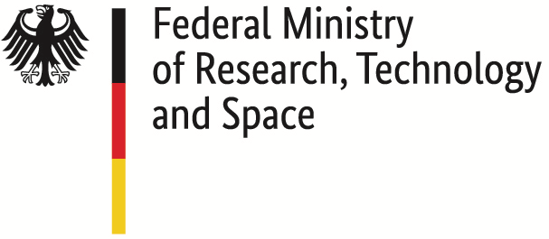
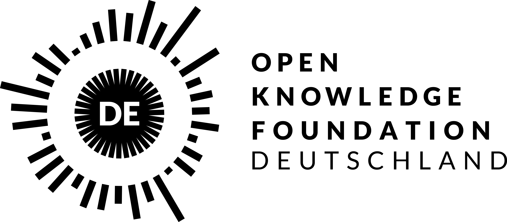

<!--
SPDX-FileCopyrightText: 2024 blinry <mail@blinry.org>
SPDX-FileCopyrightText: 2024 zormit <nt4u@kpvn.de>

SPDX-License-Identifier: CC-BY-SA-4.0
-->

# 🍃 Ethersync

Ethersync enables real-time co-editing of local text files. You can use it for pair programming or note-taking, for example! Think Google Docs, but from the comfort of your favorite text editor!

> [!CAUTION]
> The project is under active development right now. Everything might change, break, or move around quickly.

## Features

-   👥 Real-time collaborative text editing
-   📍 See other people's cursors
-   🗃️ Work on entire projects
-   🛠️ Sync changes done by text editors and external tools
-   ✒️ Local-first: You always have full access, even offline
-   🇳 Fully-featured Neovim plugin
-   🪟 VS Code plugin
-   🧩 Simple protocol for writing new editor plugins
-   🌐 Peer-to-peer connections, no need for a server
-   🔒 Encrypted connections secured by a shared password

## Documentation

**Learn how to install, use, and understand Ethersync in [the documentation](https://ethersync.github.io/ethersync).**

## Development

If you're interested in building new editor plugins, read the specification for the [daemon-editor protocol](https://ethersync.github.io/ethersync/editor-plugin-dev-guide).

For more information about Ethersync's design, refer to the list of [decision records](docs/decisions/).

## Funded by

Thanks to [NLNet](https://nlnet.nl) for funding this project through the [NGI0 Core Fund](https://nlnet.nl/core/) in 2023/24.

Thanks to the [Prototype Fund](https://www.prototypefund.de/) and the [Federal Ministry of Research, Technology and Space](https://www.bmbf.de/EN/) for funding this project in 2025.

&nbsp; &nbsp; &nbsp; &nbsp; &nbsp; &nbsp; &nbsp; &nbsp; &nbsp; &nbsp; &nbsp; &nbsp; 

## License

This program is free software: you can redistribute it and/or modify it under the terms of the GNU Affero General Public License as published by the Free Software Foundation, either version 3 of the License, or (at your option) any later version.

This project is [REUSE](https://reuse.software) compliant, see the headers of each file for licensing information.
