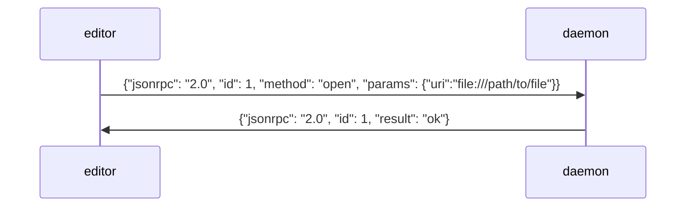

# Editor plugin development guide

This document describes the protocol between the Ethersync daemon and the text editors. It should contain everything you need to implement a plugin for a new editor!

## How to connect to the daemon

Ethersync consists of two parts: The daemon and editor plugins.

The daemon takes care of synchronization with other peers. An editor, on the other hand, has to communicate with the daemon to send it changes made to the file by the user, as well as changes of cursor positions. The daemon will send other people's changes and cursor positions back to the editor.

To make this as easy as possible for your plugin, we're using the same protocol as the [Language Server Protocol](https://microsoft.github.io/language-server-protocol/overviews/lsp/overview/): [JSON-RPC](https://www.jsonrpc.org/specification). So if your editor plugin system allows connecting to an LSP, you'll hopefully can re-use the component opening a JSON-RPC connection.

The editor plugin will need to spawn the command `ethersync client` (which is our helper tool to connect to a running Ethersync daemon), and speak JSON-RPC (with Content-Length headers) with the standard input/output of that process. Think of `ethersync client` as the LSP Server when looking at it from the editor's perspective.

## File ownership

Ethersync has the concept of file ownership. By default, the daemon has ownership, which means that, as connected peers make changes to files, it will write the changes directly to the disk.

But when an editor sends an "open" message, it takes ownership; all changes to the file by other sources will now be sent through the editor plugin. This is because text editor usually don't like it if you change to files they have opened.

When the last editor gives up ownership by sending a "close" message, the daemon takes ownership again.

## Editor revision and daemon revision

For each open file, editors store two integers:

- The *editor revision* describes how many changes the user has made to the file. It needs to be incremented after each edit made by the user.
- The *daemon revision* describes how many changes the editor received from the daemon. It needs to be incremented after receiving an edit from the daemon.

## How the editor recognizes Ethersync-enabled directories

Similar how Git repositories have a `.git` directory at the top level, Ethersync-enabled directories have an `.ethersync` directory at the top level. The editor must only send messages for files inside Ethersync-enabled directories.

## The daemon-editor protocol

Here's the nitty-gritty details of what messages the daemon and the editor use to talk to each other.

### Basic data types

The protocol uses a couple of basic data types (we're using the same syntax to specify them as the [LSP specification](https://microsoft.github.io/language-server-protocol/specifications/lsp/3.17/specification/):

- `DocumentUri = string`

    This is an absolute file URI, for example: "file:///home/user/bla/fu.txt"`.

- `Position: {line: number, character: number}`

    A position inside a text document. Characters are counted in Unicode characters (as opposed to UTF-8 or UTF-16 byte counts).

- `Range: {start: Position, end: Position}`

    A range inside a text document. For cursor selections, the *end* is the part of the selection where the active/movable end of the selection is.

- `Delta: {range: Range, replacement: string}[]`

    A complex text manipulation, similar to LSP's [`TextEdit[]`](https://microsoft.github.io/language-server-protocol/specifications/lsp/3.17/specification/#textEditArray). Like in LSP, all ranges refer to the starting content, and must never overlap, see the linked LSP documentation.

- `RevisionedDelta: {delta: Delta, revision: number}`

    This attaches a revision number to a delta. The semantics are that the delta *applies to* (is intended for) that specified revision.

### Messages sent by the editor to the daemon

These should be sent as JSON-RPC requests, so that the daemon can send back errors.

#### `"open" {uri: DocumentUri}`



- Sent when the editor opens a document. The daemon will respond either with a success, or with an error describing why the file could not be opened (for example, because it is an ignored file, or if it's not part of the daemons shared project).
- When an open succeeds, the editor gets ownership of the file, and the daemon will start sending updates for it as they come in.
- The editor has to initialize its editor revision and daemon revision for that document to 0.

#### `"close" {uri: DocumentUri}`

- Sent when the editor closes the file. It is no longer interested in receiving updates.

#### `"edit" {uri: DocumentUri, delta: RevisionedDelta}`

- The `revision` attribute of `RevisionedDelta` is the last revision seen from the daemon.
- After each user edit, the editor must increase its editor revision.

#### `"cursor" {uri: DocumentUri, ranges: Range[]}`

- Sends current cursor position/selection(s). Replaces the previous cursor ranges.

### Messages sent by the daemon to the editor

These should be sent as notifications, there is no need to reply to them.

#### `"edit" {uri: DocumentUri, delta: RevisionedDelta}`

- `revision` in the `RevisionedDelta` is the last revision the daemon has seen from the editor.
- If this is not the editor revision stored in the editor, the editor must ignore the edit. The daemon will send an updated version later.
- After applying the received edit, the editor must increase its daemon revision.

#### `"cursor" {userid: integer, name?: string, uri: DocumentUri, ranges: Range[]}`

- The daemon sends this message when user's cursor positions or selections change, regardless of whether the file has been opened in the editor. The editor can use this information to display in which files other people work.

## Tools to help you develop and debug a new plugin

### Sending an example message to the daemon

To send messages to the daemon manually, you can try the following. Assuming you can start the daemon on a playground similar to the [Quickstart](quickstart.md), now we add some debugging output:
```bash
ethersync daemon playground -d
# Note for below: You will see some output like "Listening on UNIX socket: /tmp/ethersync"
```
You can then start the client, in another terminal:
```bash
ethersync client
```
This will already produce an output in the daemon which indicates that an Editor connected.
This happens because the client connects to the `/tmp/ethersync` socket.
Killing it shows the opposite: "Editor disconnected".

Next, you could manually send some JSON-RPC. We included a Python script to help you create messages in the correct format: Run it to see what an open message could look like:

```bash
python tools/dummy-jsonrpc.py playground/file
```

You can send it to the daemon like this:

```bash
python tools/dummy-jsonrpc.py playground/file | ethersync client
```

### Seeing what an existing Ethersync plugin sends

On the other hand, not running any daemon, you can see what the plugin "wants" to communicate as follows.
In the demon console (stop it), we now just plainly listen on the socket for incoming data:
```bash
# nc can only bind to existing sockets, so we'll drop potentially existing ones
rm /tmp/ethersync; nc -lk -U /tmp/ethersync
```

In the client console, start nvim on a file, move the cursor and edit something:
```bash
nvim playground/file
```

### Starting two local daemons

For testing purposes, it can be useful to simulate having two peers connecting to each other.

Do do that on a single machine, follow these steps:

1. Start one daemon regularly, we will call its directory the "first directory".
2. Create a new, empty shared directory (with an `.ethersync` directory in it) for the second daemon.
3. Start the second daemon:
    - The directory should be the additional directory you created.
    - Set the `--peer` option to the address of the first daemon.
    - Set `--socket-path` to a new value like `/tmp/ethertwo`.
4. Connect an editor to the first daemon by opening a file in the first directory.
5. Connect an editor to the second daemon by setting the environment variable `ETHERSYNC_SOCKET` to the new value before opening a file in the second directory.
    - Example: `ETHERSYNC_SOCKET=/tmp/ethertwo nvim directory2/file`

Things you type into the first editor should now appear in the second editor, and vice versa.
